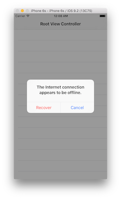
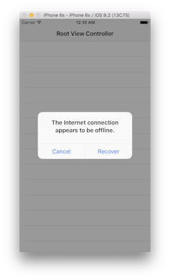

# Alert

An iOS framework for effectively building alerts encouraged by HIG

## Usage

```swift
let alert = Alert.Confirmation(error)
presentViewController(alert.viewController, animated: true, completion: nil)
```


```swift
let recovery = Recovery(name: "Recover", style: .Nondestructive) { action in
    print("Recover!!")
}
let alert = Alert.Suggestion(error, recovery)
presentViewController(alert.viewController, animated: true, completion: nil)
```



```swift
let recovery = Recovery(name: "Recover", style: .Destructive) { action in
    print("Recover!!")
}
let alert = Alert.Suggestion(error, recovery)
presentViewController(alert.viewController, animated: true, completion: nil)
```



## Installation

### Carthage

```rb
github "naoty/Alert"
```

### CocoaPods

```rb
pod "NTYAlert"
```

## Author

[naoty](https://github.com/naoty)

